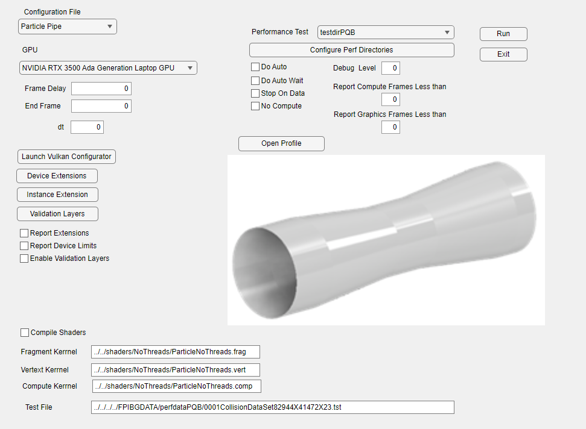
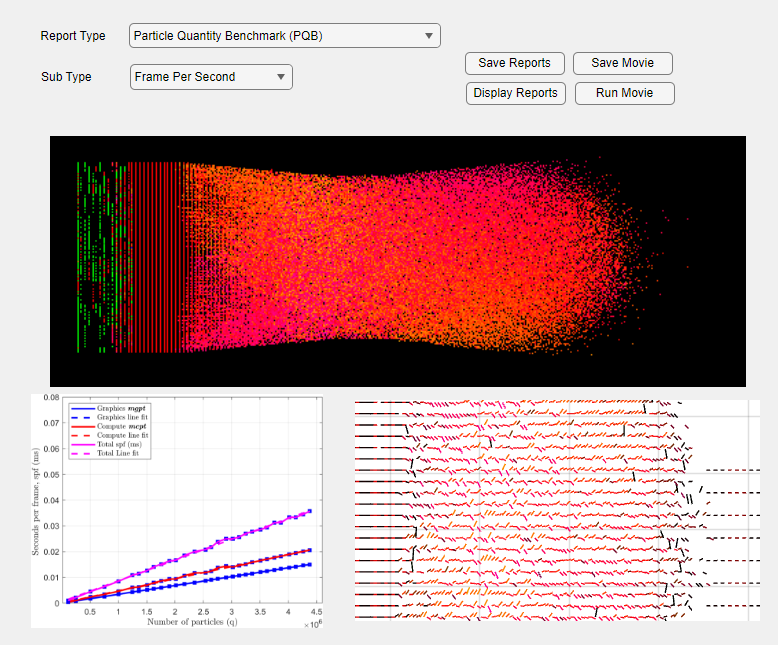

# **FPIBGUtility**

## **Assignment Details**
**Project Name**: FPIBGUtility  
**Project Description**: Python-based utilities for configuring, controlling, and analyzing FPIBG particle flow simulations.  
**Team Members**:  
- Jackie Bell - Back-End Engineer  
- Efren Lopez - Front-End Engineer  

---

## **Original Project Proposal** *(By Jackie Bell)*

### **Overview**

I have a software application (called FPIBG) that uses the Graphics Processor to perform particle flow simulations.
It is not a Web application so the back and front ends are defined differently. This application is written in C++ using the 
Vulkan API but this will not be part of the project. Instead we are writing code to control it in Python.

It is a great project for people wanting to go into reaserch becasue there is allot of analysis of algoritm performance (time complexity)
and formating analysis data. Nothing is complicated and all of the code is prototyped in Matlab.

The paper on the application can be found here:
https://github.com/fieldparticle/FPIBG/blob/main/2024_10_22_FPIBG_For%20_Publish.pdf

The application needs a front-end to configure and launch the FPIBG simulation run and a back-end to produce reports 
from the generated data. I need to use Pyton because the research comunity in the particle simulation field uses it
for these kinds of utilities. It also needs to be portatble across **Windows**, **Linux**, and **macOS**.

---

### **Front-End**

The front provides the following facilities:  
1. Reads and writes to a configuration file via the `libconfig` API.  
2. Reads an image of the flow device in a 3D file format called Wavefront (`*.obj`) being studied.  
   - [More on Wavefront Format](https://en.wikipedia.org/wiki/Wavefront_.obj_file)  
3. Launch and control the simulation via TCP/IP.  

The configuration file provides the data for the FPIBG run. One of those configuration items is the profile of the device through which the particles will flow. The example GUI below shows a Converging-Diverging Nozzle, but it can be anything like a section of round pipe.  

The front-end must be a separate utility that communicates with the application via TCP/IP because it can:  
- Run the FPIBG application locally.  
- Launch multiple tasks of the application in a High-Performance Computing (HPC) environment (not included in this project).  

---

### **Back-End**

The back-end provides the following features:  
1. Reads data generated by the simulation run.  
2. Produces and displays plots of the data.  
3. Writes those plots in LaTeX format for inclusion in report documents.  
4. Reads captured image files of each frame and converts the color values at each pixel into scalar or vector fields.  
5. Plots the scalar or vector fields to LaTeX format for integration in reports.  
6. Assembles image files into movies.  

